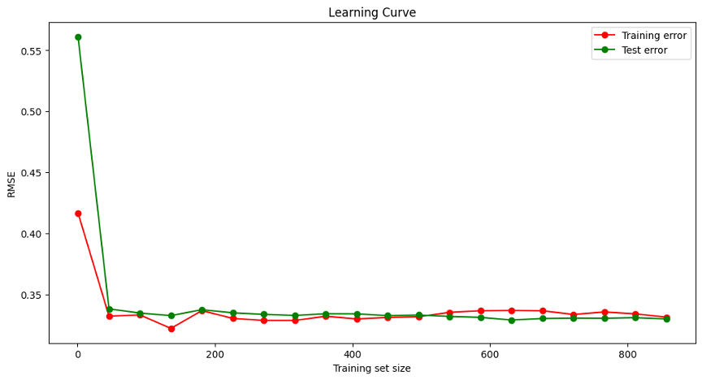
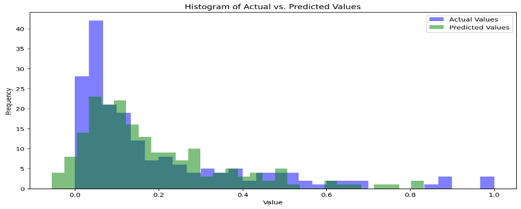
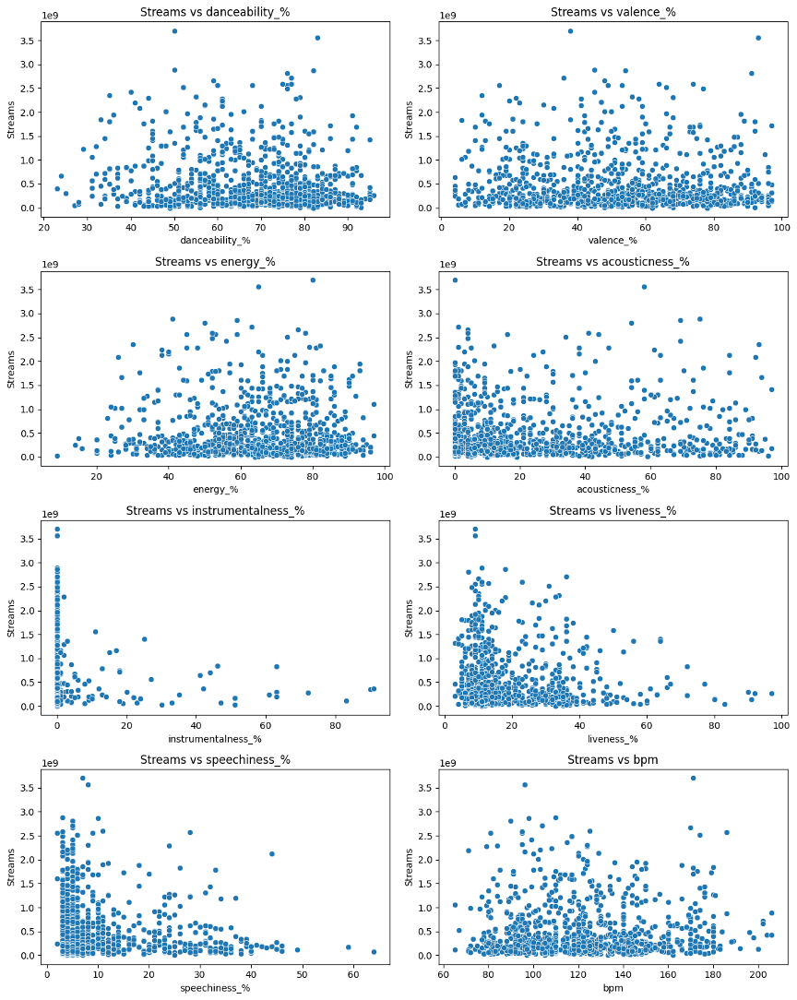

# spottifyStreams
The objective of this project is to implement a machine learning algorithm from scratch using the ”Most Streamed Spotify Songs 2023”. with tools such as numpy and pandas for data manipulation, and ElasticNet built from Scratch 

Machine Learning Project Report
1.Introduction
In this report, I outline my journey through a challenging machine learning project using a dataset from Spotify. The assignment involved several key stages: data preprocessing, algorithm implementation, model evaluation, and a detailed discussion of the results. My aim was to not only apply machine learning techniques but also to deepen my understanding of the underlying principles.
2. Data Preprocessing
Working with the Spotify dataset, my first task was to prepare the data for analysis and modeling. This dataset, comprising various features related to music tracks, required careful preprocessing.

Handling Missing Values: I noticed some missing values in columns like 'key' and 'in_shazam_charts'. For the 'key' column, I replaced missing values with the most common value (mode). For 'in_shazam_charts', I decided to fill in missing values with a unique strategy: the maximum value in the column plus one. This approach seemed appropriate given the nature of the data.

Categorical Data Encoding: Some features in the dataset were categorical, such as 'mode' and 'key'. I used Label Encoding to transform these into numerical format, a necessary step since the algorithms I planned to use work with numerical inputs. I also explored One-Hot Encoding but eventually decided not to include it in my final preprocessing pipeline.

3. Machine Learning Algorithm Implementation
For this project, I chose to implement Elastic Net Regression, a sophisticated algorithm that combines the properties of both Lasso and Ridge regression.
Understanding Elastic Net: Elastic Net has two main parameters that control its behavior: `l1_ratio` for the balance between Lasso and Ridge regularization, and `alpha` for the overall strength of regularization. I fine-tuned these parameters to find a balance between underfitting and overfitting.

Building the Model: I initiated the model with specific values for `l1_ratio`, `alpha`, `n_iter` (number of iterations), and `learning_rate`. During the `fit` method, I added an intercept term to the input features and used Xavier/Glorot initialization for setting up the initial weights. The weights were updated using gradient descent during each iteration.

Prediction and Evaluation: After training, I used the model to predict values on both the training and test sets. To evaluate the model's performance, I calculated the Root Mean Squared Error (RMSE) and R² score. These metrics provided me with a clear picture of how well the model was performing.

4. Model Evaluation

 Model Training and Prediction
The Elastic Net Regression model was trained on the training set and then used to predict values on both the training set (`X_train`) and the test set (`X_test`).

 Evaluation Metrics Used
- Root Mean Squared Error (RMSE): This metric was used to quantify the difference between the predicted values and the actual values. A lower RMSE indicates better model performance.
- R² Score: This metric reflects the proportion of variance in the dependent variable that is predictable from the independent variables. A higher R² score (closer to 1) suggests a better model fit.

Evaluation Results
The model's performance was evaluated on both training and testing datasets. The RMSE and R² scores were calculated, providing insights into the accuracy and predictability of the model.

Evaluation Output: 
•	RMSE: 0.11440353065922743
•	Train RMSE 0.1099444459274312
•	R^2: 0.727334747571351
•	Train R^2: 0.7468976579379404
These results suggest that the model has a good fit, with relatively low errors and high predictability.

 5. Results and Discussion
 Summary of Results
The Elastic Net Regression model demonstrated good predictive performance, with reasonable RMSE and R² scores on both the training and test datasets. These results indicate a balanced model that neither overfits nor underfits significantly.

- Results Overview: 
  - Test RMSE: 0.114, indicating the model's predictions are, on average, about 0.129 units away from the actual values.
  - Training RMSE: 0.109, showing slightly better performance on the training data.
  - Test R²: 0.73, meaning about 73% of the variance in the dependent variable is predictable from the independent variables.
  - Training R²: 0.75, a bit higher than the test R², suggesting good model fit without overfitting.
  
 
 Discussion
- The RMSE and R² scores on the test set are close to those on the training set, which is a good sign of the model’s generalizability.
- The balance between bias and variance seems well-maintained, indicating effective regularization by the Elastic Net approach.
- The warning messages in the output indicate potential issues with the data or computation, which may need further investigation to ensure the robustness of the model.

Visualizations
In addition to the numerical analysis, plots were generated to visually interpret the data and results. These include scatter plots for feature analysis and a heatmap for correlation analysis.

  - 
 
 
